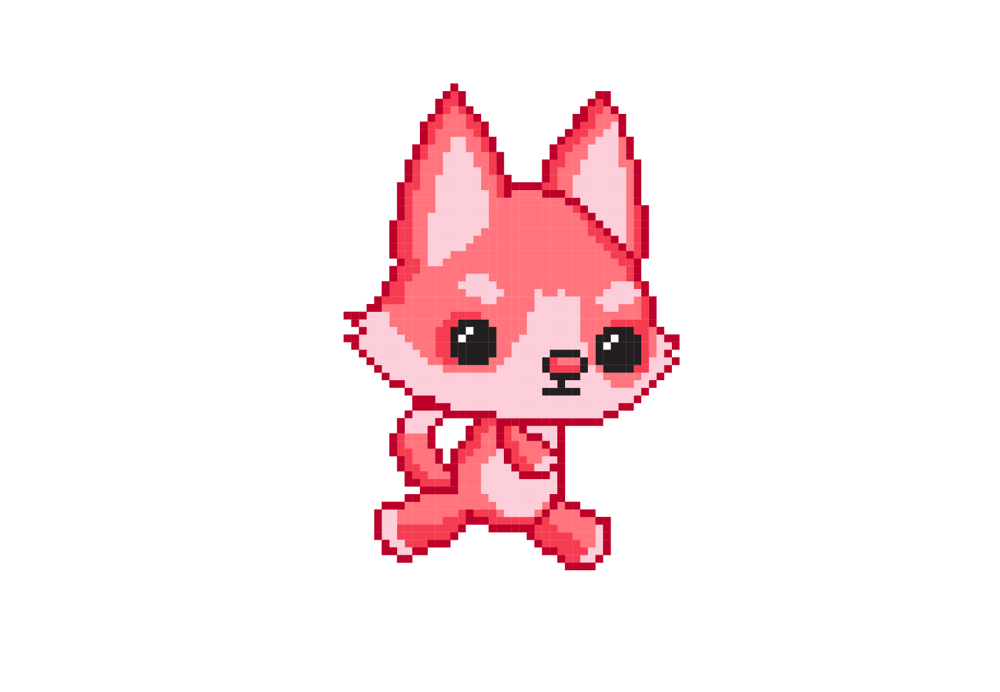
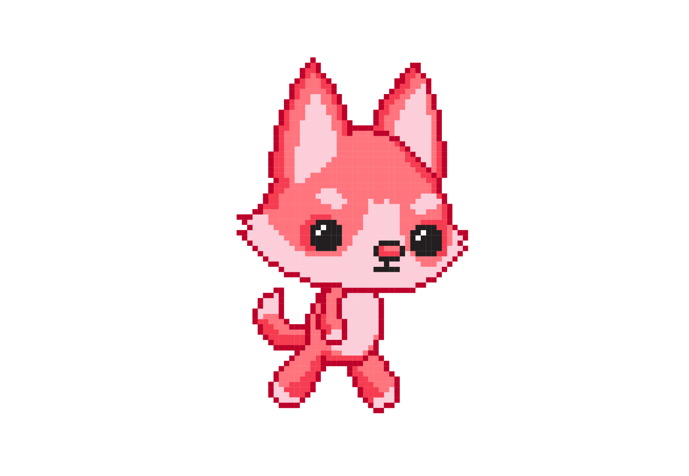
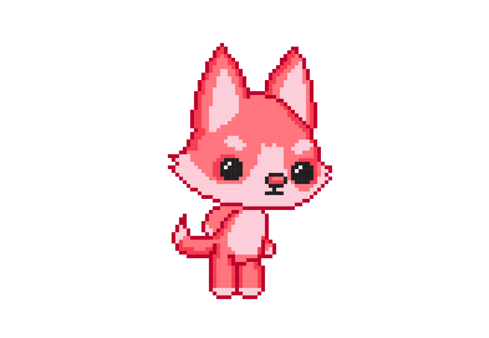
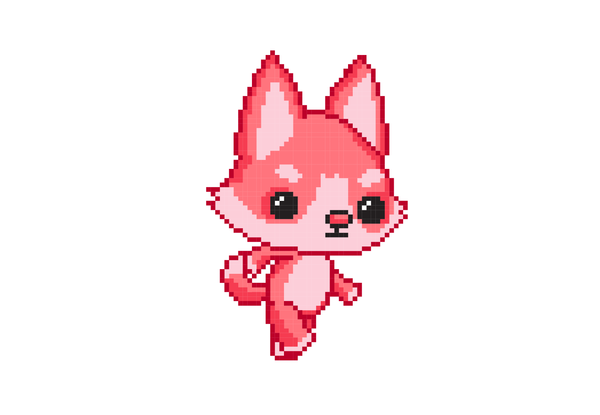

Предлог пројекта - С обе ноге у Пајгејму
========================================

Скок у Пајгејм
--------------

Завршивши курс на Петљи посвећен Пајгејму направио/направила сие први корак ка прављењу рачунарских игрица. Да би сутра правио/правила игрице, било је прво потребно да направиш мале кораке у том правцу учећи о координатама, употреби петљи и цртању неких облика. Међутим, у курсу који си завршио/завршила само си загребао/загребала по површини онога што Пајгејм има да понуди. 

Идеја овог пројекта је да ти помогне да направиш следећи корак у учењу Пајгејма и да вас уведе у свет анимације. 

Вероватно већ знаш да цртани филм настаје тако што се на екрану брзо смењују сличице, при чему је свака следећа слика веома слична претходној (ликови на слици су само мало померени у односу на претходни положај).

На пример, од наредних осам сличица лика у различитим положајима:

.. image:: ../_images/liktrci1.png
   :width: 120px

.. image:: ../_images/liktrci7.png
   :width: 120px
.. image:: ../_images/liktrci8.png
   :width: 120px

настаје следећа анимација трчања:
           
.. image:: ../_images/liktrci.gif
   :width: 120px

.. infonote::

    Циљ овог пројекта био би да напишеш програм којим ћеш направити неку анимацију помоћу библиотеке Пајгејм.

Анализа и планирање
-------------------
Први изазов овог пројекта биће да разумеш како анимације раде и како се уопште оне програмирају у Пајгејму. Не брини, ово није много компликовано, али захтеваће мало труда и припреме пре него што почнеш да самостално програмираш.

Да би могао/могла да урадиш овај пројекат и да би се упознао/упознала са анимацијама у Пајгејму, биће потребно да прочиташ додатну лекцију из нашег приручника `Програмирање графике помоћу Pygame <https://petlja.org/biblioteka/r/lekcije/pygame-prirucnik/animacije-cas11>`__. Не брини, испод ћемо ти навести и тачне поднаслове те лекција које је потребно да прочиташ како би могао/могла да правиш оно што желиш. 

Када то урадиш, предстоји ти још један велики корак, а то је одабир тога шта ћеш анимирати. Биће потребно да изабереш слике које желиш да анимираш и да видиш са којим циљем то уопште желиш да урадиш. Да ли желиш да направиш анимацију кретања облака у временској прогнози, да ли желиш да направиш нешто што ће личити на цртаћ, да ли желиш да направиш нешто што ће личити на рачунарску игрицу - то су питања која треба себи да поставиш пре него што кренеш са радом. 

Када одлучите шта желиш да анимираш, биће потребно да пронађеш или направиш одговарајуће фајлове. Посебно занимљиво би могло да буде ако би пробао/пробала да направиш сопствене ликове које желиш да анимираш. Ако ти цртање није јача страна, можда можеш да пројекат урадиш са неким другаром/другарицом који ће ти помоћи у дизајну сопствених ликова, слика и осталих елемената анимације коју ћеш/ћете направити.

Ресурси
'''''''

За овај пројекат најважније ће бити да прво прочиташ следеће делове нашег Приручника: 
- https://petlja.org/biblioteka/r/lekcije/pygame-prirucnik/animacije-cas11#id2 
- https://petlja.org/biblioteka/r/lekcije/pygame-prirucnik/animacije-cas11#id4
- https://petlja.org/biblioteka/r/lekcije/pygame-prirucnik/animacije-cas11#id7
- https://petlja.org/biblioteka/r/lekcije/pygame-prirucnik/animacije-cas11#id9
- https://petlja.org/biblioteka/r/lekcije/pygame-prirucnik/animacije-cas11#id15

Ако желиш да твој пројекат садржи и анимације кретања препоручујемо да погледаш и ова поглавља: 
- https://petlja.org/biblioteka/r/lekcije/pygame-prirucnik/animacije-cas11#id8
- https://petlja.org/biblioteka/r/lekcije/pygame-prirucnik/animacije-cas12#id2

И након тога урадиш задатке у овом поглављу https://petlja.org/biblioteka/r/lekcije/pygame-prirucnik/animacije-cas12

Код за анимацију
''''''''''''''''

Ако си прочитао/прочитала све што смо ти препоручили, пробај да анализираш следећи код. Твој код ће вероватно изгледати слично као и овај. Овде смо ти дали један могућ пример тога како се прави анимација, али очекујемо да ћеш, ако се одлучиш за овај пројекат, сигурно изабрати занимљивије слике, позадине, ликове и сл. 

Обрати посебну пажњу на начин на који су слике укључене у код и на начин на који се слике смењују у анимацији. Обрати пажњу како је упторебљена листа и како је касније у функцији за нови фрејм укључена одговарајућа слика. 

Посебну пажњу обрати како је упторебљено спајање стрингова у називу слике.  

.. activecode:: crtani_film
   :nocodelens:
   :modaloutput: 
   :enablecopy:
   :playtask:
   :includexsrc: _includes/setanje_animacije.py

   # učitavamo u listu slike setanje1.png, setanje2.png, ..., setanje5.png
   slike = []   # niz u koji dodajemo slike
   for i in range(1, 6):
       naziv_slike = "setanje" + str(i) + ".png"  # gradimo naziv slike od delova
       slike.append(pg.image.load(naziv_slike))   # učitavamo sliku i dodajemo je na kraj niza

   slika = 0  # indeks tekuće slike

   def crtaj():
       prozor.fill(pg.Color("white"))     # bojimo pozadinu prozora u belo
       prozor.blit(slike[slika], (0, 0))  # prikazujemo sliku

   def novi_frejm():
       global slika  # ovu globalnu promenljivu menjamo
       slika = (slika + 1) % len(slike)  # prelazimo na sledeću sliku
       crtaj() # ponovo crtamo scenu

Размисли о томе како би унапредио/унапредила овај код. Шта би још додао/додала? 

Размишљај о томе да додаш неку позадину твом пројекту као и о томе да можеш да анимираш више ствари од само једног лика који се креће. Размишљај о томе да ли евнетуално желиш да твојим анимацијама додаш и кретање објеката по екрану. 

Самоевалуација
--------------

Када направиш програм, покушај да (пре свега себи) одговориш на ова питања:

- Да ли је, по твојој процени, пројекат успешно приведен крају? Колико си ти лично задовољан-задовољна урађеним? Зашто?
- Који део је био посебно тежак? Како си га решио-решила? Да ли је постојао неки проблем чијим решавањем се посебно поносиш?
- Да ли је било накнадних измена првобитног плана? Због чега?
- Да ли је пројекат био користан за стицање или унапређивање неких знања или вештина? Којих?

Размисли шта од овога би било интересантно другима да чују током твог представљања пројекта. 
