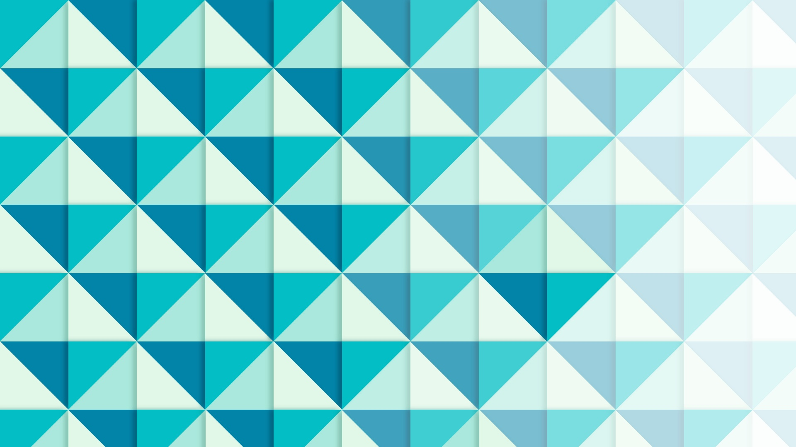

Предлог пројекта - *Smart art*
==============================

Геометријске правилности у уметности
------------------------------------

У претходном пројекту видели смо уметност са почетка и средине двадесетог века, а у овом пројекту видећемо нешто што је сличније уметности друге половине двадесетог века. Како је интересовање за геометрију у сликарству представљало једну од доминантних инспирација у уметничком свету, друга половина двадесетог века изродила је низ уметника који су геометријске правилности ставили у жижу свог интересовања. 

Ако погелдамо неке савремене уметнике, као што је Виктор Вазарели (Victor Vásárhelyi), моћи ћемо да видимо једну опсесију геометријском правилношћу помешаном са фасцинацијом светлошћу, начином на који људско око перципира облике, светлине и сл. Овај уметник сматра се једним од отаца правца оп арт (optical art). Уметници овог правца често се занимају за прављење оптичких илузија, прављење образаца који ствара илузију дубине, илузију простора или неку другу оптичку варку управо помоћу геометријских образаца. 

Ако бациш брз поглед на неколико радова овог уметника одмах ће ти бити јасно зашто нам је занимљив и шта желимо са овим пројектом.

- https://www.artsy.net/artwork/victor-vasarely-folkokta-1
- http://www.op-art.co.uk/victor-vasarely/
- https://media.artgallery.nsw.gov.au/collection_images/Alpha/OO1.1970%23%23S.jpg

.. infonote::

    Као што ти је вероватно већ очигледно, циљ овог пројекта биће да пронађеш (или измислиш) неки занимљив геометријски образац који ћеш исцртати помоћу Пајгејма. 

Анализа и планирање
-------------------

Твој задатак у овом пројекту биће да осмислиш како да напишеš један Пајгејм програм који ће исцртати неки сличан образац. Прво што мораш да урадиш је да пронађеш образац или неко уметничко дело које ћеш желети да репродукујеш. Ми ти препоручујемо да погледаш дела већ поменутог Виктора Вазарелија, Јозефа Алберса (Josef Albers) или Жан Пјер Иваралa (Jean-Pierre Yvaral), али ако на другом месту пронађеш неки одговарајући образац или, још боље, успеш сам/сама да га осмислиш и то ће бити одговарајуће. 

Када пронађеш образац долазиш до најважнијег дела пројекта, а то је осмишљавање како да напишеш код да би тај образац био исцртан помоћу Пајгејма. 

Погледај следеће две слике 

  
|

Пробај на њима да уочиш који се то елементи понављају дуж целих слика и пробај да уочиш на који се начин ти елементи понављају. Пробај да видиш шта је најмањи елемент који је можеш да нацрташ и чијим понављањем можеш да добијеш слике какве овде видиш. Када уочиш који је то најмањи елемент пробај да испланираш како да тај елемент ротираш и поновиш га тако да добијеш одговарајући образац. 

Конкретније, размишљај о томе како се координате тачака тих елемената мењају приликом понављања, пробај да размислиш о томе како се боје мењају и пробај да испланираш како би то све искодирао/искодирала. 

Пробај да размислиш шта ће ти бити потребно од програмерских техника које си до сада савладао/савладала. Размисли о томе да ли си се приликом решавања задатака у нашем курсу срео/срела са сличним проблемом. 

Пример обрасца
''''''''''''''

Овде ћемо ти понудити један геометријски образац који смо припремили за тебе и чији је циљ да те инспирише да покушаш да направиш свој. Обрати посебну пажњу на неколико делова кода.

.. activecode:: kutije
   :nocodelens:
   :modaloutput: 
   :enablecopy:
   :playtask:
   :includexsrc: _includes/kutije.py

   #fiksne vrednosti koje ćemo koristiti za pomeraj tačaka u crtanju pomoću petlje
   ort_i = (30, 15) 
   ort_j = (-50, 20)
   ort_k = (0, -40)
   #ove dve vrednosti nam pomažu prilikom dohvatanja elemenata torki 
   X, Y = 0, 1

   prozor.fill(pg.Color("black"))

   #boje 
   zuta_svetlija = (255,255,0)
   braon = (165,42,42)
   zuta_tamnija = (240,230,140)

   def crtaj_kutiju(A, h):
      #crtamo jednu kutiju vodeći računa da su nam sve definisane u odnosu na koordinate tačke A i veličinu h
      B = (A[X] - ort_j[X], A[Y] - ort_j[Y])
      C = (B[X] - ort_i[X], B[Y] - ort_i[Y])
      D = (A[X] - ort_i[X], A[Y] - ort_i[Y])
      A1 = (A[X] + h * ort_k[X], A[Y] + h * ort_k[Y])
      B1 = (B[X] + h * ort_k[X], B[Y] + h * ort_k[Y])
      C1 = (C[X] + h * ort_k[X], C[Y] + h * ort_k[Y])
      D1 = (D[X] + h * ort_k[X], D[Y] + h * ort_k[Y])
      pg.draw.polygon(prozor, braon, [A, D, D1, A1])
      pg.draw.polygon(prozor, zuta_svetlija, [A, B, B1, A1])
      pg.draw.polygon(prozor, zuta_tamnija, [A1, B1, C1, D1])

   #broj kutija u spoljnem sloju 
   broj_kutija=5

   #glavna petlja programa u kojoj ponavljamo jednu kutiju broj puta definišemo pomoću broj_kutija
   for red in range(broj_kutija):
       for kol in range(broj_kutija - red):
           x = sirina // 2 + red * ort_j[X] + kol * ort_i[X] #određujemo x koordinatu tačke A
           y = 2*visina // 3 + red * ort_j[Y] + kol * ort_i[Y] #određujemo y koordinatu tačke A
           h = max(broj_kutija - red - kol, 0) 
           crtaj_kutiju((x, y), h)

Прво и најважније, обрати пажњу на који начин су употребљене угнежђене петље. Погледај шта се дешава са координатама тачке А у сваком проласку кроз петљу.

Обрати пажњу на то као користимо константне вредности да бисмо повећавали вредност координата. Погледај онда како се у односу на тачку А праве све остале тачке које учествују у цртању ових облика.

Размисли како би за твој образац изгледала петља. Пробај да прво за сваку релевантну тачку свог обрасца објасниш шта треба да се деси, а затим пробај да видиш како би то претворио/претворила у петљу, то јест размишљај шта се дешава са координатама сваке релевантне тачке твог одабраног обрасца. 

Размисли да ли и ти треба да дефинишеш неке константне вредности које треба да повећаваш или смањујеш током проласка кроз петљу.

Размишља шта се дешава са бојом. Пробај да се са бојом поиграш на начин који није предочен овим примером, али са којим си се сигурно сусрео/сусрела у курсу. Пробај да унесеш елементе насумичног у дистрибуцију боје. Размисли како би то урадио/урадила.

На крају, пробај да све ово доживиш као игру. Поиграј се са различитим вредностима и види шта се дешава. 

Самоевалуација
--------------

Када направиш програм, покушај да (пре свега себи) одговориш на ова питања:

- Да ли је, по твојој процени, пројекат успешно приведен крају? Колико си ти лично задовољан-задовољна урађеним? Зашто?
- Који део је био посебно тежак? Како си га решио-решила? Да ли је постојао неки проблем чијим решавањем се посебно поносиш?
- Да ли је било накнадних измена првобитног плана? Због чега?
- Да ли је пројекат био користан за стицање или унапређивање неких знања или вештина? Којих?

Размисли шта од овога би било интересантно другима да чују током твог представљања пројекта. 

