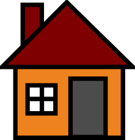

Предлог пројекта - Саградимо кућу
=================================

Мотивација
---------------

.. questionnote::
    Да ли се сећаш бајке о Ивици и Марици и  њеног најслађег дела - **кући од чоколаде**?
  

Од свог постанка на планети Земљи људи су градили себи склоништа и живели су углавном у пећинама. Тражили су и правили 
места где ће се са породицама сместити како би били што заштићенији од других живих врста као и од различитих временских
услова и непогода. Градња је била веома важан елемент њиховог опстанка. Како је време пролазило, градња кућа је 
напредовала и мењали су се стилови градње. 
Савремена градња и грађевински материјали су веома узнапредовали.
Грађевински радници деле посао према свом знању и вештинама, а грађевина се изучава у школама и на факултетима и 
институтима.

.. questionnote::
    Да ли си некада размишљао/размиљала или посматрао/посматрала како се гради нека кућа или зграда?

Анализа и планирање
-------------------

Истражи на интернету еволуцију (напредовање) градње. Направи кратку презентацију са прикупљеним подацима (текстом и 
сликама) коју 
ћеш презентовати разреду. Потражи помоћ наставника техничког образовања и наставника технике и технологије око 
неких додатних информација.

На часовима техничког правили сте мале куће (макете) које су изгледале исто као праве куће по свом облику.
За израду сте користили папир, картон, дрво лепак, боје итд. Хајде сада да  искористимо друге алате (из
Пајтона и Пајгејма) да програмом нацртамо и обојимо кућу (можда и целу улицу). Искористимо досадашње знање, подсетимо се алата који
ће нам бити потребни и уживајмо у раду! 

Ресурси
-------

За прављење презентације и писање програма потребан вам је рачунарски кабинет и интернет.
Такође, поразговарајте са својим наставницима, првенствено наставником технике и технологије и 
техничког образовања који вас могу детаљније упутити у значај градње за људе. 

Напишите неки чланак, направите неки пано, посветите неки час овој теми. 

Код за цртање куће
------------------

Вашу кућицу можете да нацртате како ви желите у договору са вашим наставником. Можете искористити и делове наредног
кода, а можете кренути и са вашом идејом од самог почетка.

.. infonote::
    Ако савладате следеће објашњење моћи ћете једноставно да нацртате целу улицу са копијама ваше куће.
    Покушајте, бићете изненађени великим успехом!

За почетак, отредсетимо се апсолутних и релативних координата.
Рецимо да сте написали овај програм за цртање кућице, а циљ вам је да преправите
програм тако да кућица може једноставно да се нацрта и на другом месту:

.. activecode:: PyGame_house_detailed_fixed
    :nocodelens:
    :enablecopy:
    :modaloutput:
    :includesrc: _includes/kuca_2d_apsolutno.py

Нека је главна тачка (сидро) :code:`(x, y) = (50, 150)`. Довршите
започето преправљање програма у пољу испод, у коме се цртање обавља у
функцији :code:`kuca(x, y, boja_zidova)`. Када се уверите да цртежи у
два програма изгледају исто (осим што су прозори различите величине),
замените позив :code:`kuca(50, 150, pg.Color("khaki"))` са следећа четири,
да бисте добили слику као кад се кликне на дугме "Прикажи пример":

.. code::

    kuca(150,  90, pg.Color(220, 220, 220))
    kuca(220, 130, pg.Color("white"))
    kuca(350, 160, (255,255,150))
    kuca( 50, 150, pg.Color("khaki"))

.. activecode:: PyGame_house_detailed_movable
    :nocodelens:
    :enablecopy:
    :modaloutput:
    :playtask: 
    :includexsrc: _includes/kuca_2d_relativno.py
   
    prozor.fill(pg.Color("darkgreen")) # bojimo pozadinu ekrana u tamno zeleno

    def kuca(x, y, boja_zidova):
        pg.draw.polygon(prozor, pg.Color("red"), [(x, y), (x+???, y-???), (x+140, y)]) # krov
        pg.draw.rect(prozor, boja_zidova,       (x,       y,     140, 100))   # kuca
        pg.draw.rect(prozor, pg.Color("brown"), (x + ???, y + ???,  30,  30)) # levi prozor
        pg.draw.rect(prozor, pg.Color("brown"), (x + ???, y + ???, ???, ???)) # desni prozor
        pg.draw.rect(prozor, pg.Color("brown"), (x + ???, y + ???, ???, ???)) # vrata
        
    kuca( 50, 150, pg.Color("khaki"))

Самоевалуација
--------------

Када направиш програм, покушај да (пре свега себи) одговориш на ова питања:

- Да ли је, по твојој процени, пројекат успешно приведен крају? Колико си ти лично задовољан-задовољна урађеним? Зашто?
- Који део је био посебно тежак? Како си га решио-решила? Да ли је постојао неки проблем чијим решавањем се посебно поносиш?
- Да ли је било накнадних измена првобитног плана? Због чега?
- Да ли је пројекат био користан за стицање или унапређивање неких знања или вештина? Којих?

Размисли шта од овога би било интересантно другима да чују током твог представљања пројекта. 