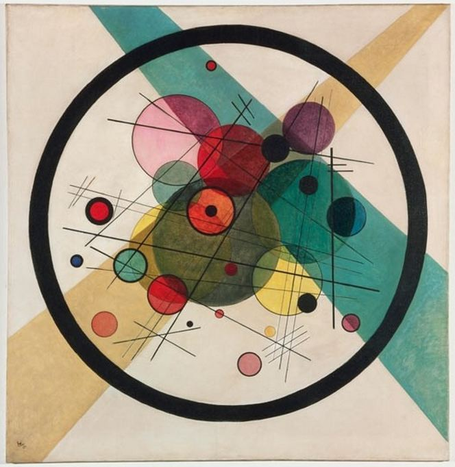
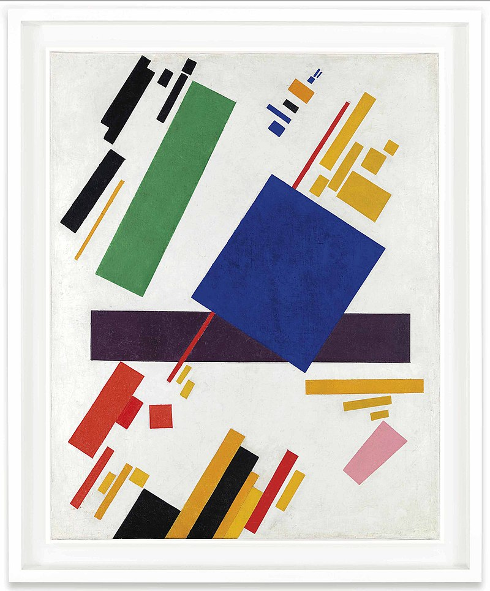
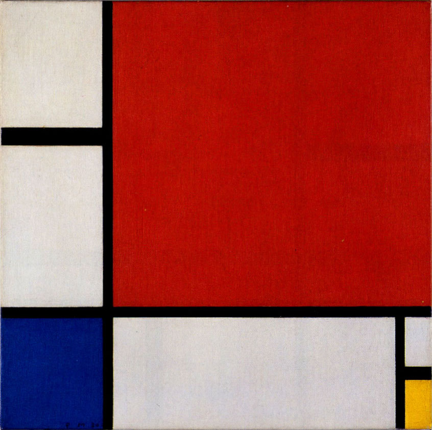

Предлог пројекта - Василиј Васиљевич Пајгемски
==============================================

Мајушни искорак у историју уметности
------------------------------------

Током прве половине двадесетог века, један од великих авангардних импулса у историји уметности резултирао је тежњом ка одустајању од стандардних образаца, тема и мотива класичне уметности. У том скретању са пута деветнаестовековне уметности, ослоњене на векове уметничког стварања који су јој претходили, уметници су, желећи да направе радикалан рез са дотадашњим стварањем, трагали за новим, аутентичним уметничким изразом. 

У сликарству се овај авангардни импулс огледао у све већој апстракцији и све већем удаљавању уметника од фигуралног сликарства. Просто речено, слике су све мање представљале стварност на реалистичан и препознатљив начин, а уметници су почели да истражују нове путеве визуелног изражавања, ослањајући се све више на боју, површину, геометрију и сличне елементе сликарске технике који су доприносили да слике све мање подражавају стварност, а све више изражавају нешто ново и до тада неизречено. 

Међу пионирима и шампионима апстрактне уметности овог периода појавила су се имена попут Пита Мондријана (Piet Mondrian), Василија Кандинског (Василий Васильевич Кандинский) и Казимира Маљевича (Казими́р Севери́нович Мале́вич). Оно што је свој тројици било заједничко је да су се, између осталих сличности, у разним фазама свог стваралаштва све више удаљавали од
фигуралног израза и ближили потпуној апстракцији. Међутим, у том одлажењу од реалистичне представе стварности, сва тројица су у своје уметничке речнике уврстили геометрију као један од централних стубова свог уметничког израза. 

Ово интересовање за геометрију изродило је слике као што су **Кругови у кругу** (1923) Кандинског.

|

Мондријанова *Композиција са плавом жутом и црвеном*

.. image:: ../_images/mondrijan_slika_1.jpg
    :width: 600px
    :align: center

|

Маљевичева *Супрематистичка композиција* (1916)

.. infonote::

    Циљ овог пројекта је да помоћу Пајгејма направиш репродукције значајних уметничких дела двадесетог века и да кроз те репродукције сазнаш нешто више о двадесетовековној уметности.

    Мораћеш да употребиш знања која си ове године прикупио/прикупила о писању Пајгејм програма, али надамо се да ће ти овај задатак бити забаван. 

Анализа и планирање
-------------------

Код овог пројекта, велики део посла састоји се у припреми и истраживању. Како је циљ и да се, поред развијања програмерских вештина, упознаш са уметношћу поменутог периода, твој први задатак био би да пронађеш најважније сликаре који су користили геометријски израз у својој уметности, као и да пронађеш дело које желиш да репродукујеш. Слободно овде проведи колико год времена ти треба док не нађеш нешто чиме си задовољан/задовољна.

Испод ћемо ти препоручити неколико страница које ти могу дати инспирацију при одабиру слика. 

На крају, када одабереш слику која ти одговара и коју желиш да репродукујеш, биће потребно да осмислиш како да је претвориш у Пајгејм кôд. Слободно се ослони на материјале у нашем курсу за Пајгејм. Пробај да испланираш које ћеш све функције за цртање употребити, којим редоследом, пробај да осмислиш које све координате мораш да пронађеш, пробај да испланираш које ће ти боје бити потребне и како да дођеш до њих. Обрати посебну пажњу на међусобне односе величина и положаја елемената пошто, ако то добро анализираш, само цртање неће бити толико проблематично.

Ресурси
'''''''
Овде ћемо ти препоручити неколико страница на којима ћеш моћи да потражиш одговарајуће слике. 

https://www.wassilykandinsky.net/work-50.php - веб-сајт посвећен стваралаштву Кандинског
http://www.artnet.com/ - страница која ти може помоћи у претраживању стваралаштва различитих сликара
http://www.kazimirmalevich.org/four-squares/ - веб-сајт посвећен стваралаштву Маљевича
https://www.moma.org/collection/works - Museum of Modern Art (New York)
http://www.pietmondrian.eu/english/individual-works/broadway-boogie-woogie/broadway-boogie-woogie.html - веб-сајт посвећен стваралаштву Мондријана
https://www.wikiart.org/ - online енциклопедија посвећена визуелним уметностима 
https://www.artsy.net/ - веб-сајт посвећен уметности, колекционарству, продаји уметничких дела, истраживању уметности

Поред ових неколико страница које ти препоручујемо, очекујемо и да ћеш сам/сама мало истражити понешто о геометријској уметности. Пробај да откријеш којим су све правцима припадали ови сликари, зашто су уопште сликали на овај начин, који још сликари осим већ поменутих могу да ти послуже као инспирација и сл. 

Ако не знаш одакле да кренеш, имена уметника која смо овде навели увек су добро полазиште за гуглање. Такође, можеш питати и наставника/наставницу ликовног да ти помогне, сигурни смо да ће њему/њој бити и више него драго што показујеш интересовање за ову област.

Пример могућег решења 
'''''''''''''''''''''

Овде ћемо ти понудити пример једне урађене репродукције која може да ти послужи као инспирација за тренутак када почнеш да куцаш кôд. 

Мондријанова *Композиција II са црвеном, плавом и жутом* (1930) је нама послужила као инспирација да се поиграмо и направимо репродукцију ове чувене слике.

 
Покрени сада следећи програм и погледај код који смо ми написали

.. activecode:: mondrijan
   :nocodelens:
   :modaloutput: 
   :enablecopy:
   :playtask:
   :includexsrc: _includes/mondrijan.py
   
   #bojimo pozadinu
   prozor.fill(pg.Color('black'))
    
   # definišemo boje koje ćemo koristiti
   crvena = (173,12,4)
   bela = (230,221,214)
   plava = (0,17,107)
   zuta = (234, 170,0)
    
   # crtamo pravougaonike
   pg.draw.rect(prozor, crvena, (210, 0, 610, 600))
   pg.draw.rect(prozor, bela, (0, 0, 195, 230))
   pg.draw.rect(prozor, bela, (0, 260, 195, 340))
   pg.draw.rect(prozor, plava, (0, 615, 195, 205))
   pg.draw.rect(prozor, bela, (210, 615, 560, 205))
   pg.draw.rect(prozor, bela, (790, 615, 30, 100))
   pg.draw.rect(prozor, zuta, (790, 740, 30, 90))

Кôд који смо овде написали није много компликован и не захтева додатна објашњења поред ових која се налазе у коментарима. Ако сте прошли наш курс програмирања у Пајгејму, не би требало да вам овај пројекат задаје превише проблема, барем не у делу писања кôда, то јест одабира функција за цртање. 

Главни изазов овог пројекта биће да се добро одреде односи величинa различитих облика, поготово ако изаберете неку захтевнију слику која садржи мноштво облика. Препоручујемо вам да приликом припреме и анализе употребљених геометријских облика употребите неки од програма за обраду слике, који вам у овом случају многу доста скратити време у проналажењу одговарајућих координата, дужина, ширина, пречника и осталих релевантних величина. Такође, програми за цртање ти могу много помоћи приликом одабира боја. 

На крају, идеална ситуација била би да све величине које користиш изразиш у релативним координатама, тако да по жељи можеш да скалираш слику коју будеш репродуковао/репродуковала. Ово није обавезно, али може ти бити занимљив изазов ако желиш да свој пројекат доведеш на један виши ниво. 

Самоевалуација
--------------

Када направиш програм, покушај да (пре свега себи) одговориш на ова питања:

- Да ли је, по твојој процени, пројекат успешно приведен крају? Колико си ти лично задовољан/задовољна урађеним? Зашто?
- Који део је био посебно тежак? Како си га решио/решила? Да ли је постојао неки проблем чијим решавањем се посебно поносиш?
- Да ли је било накнадних измена првобитног плана? Због чега?
- Да ли је пројекат био користан за стицање или унапређивање неких знања или вештина? Којих?

Размисли шта од овога би било интересантно другима да чују током твог представљања пројекта. 

