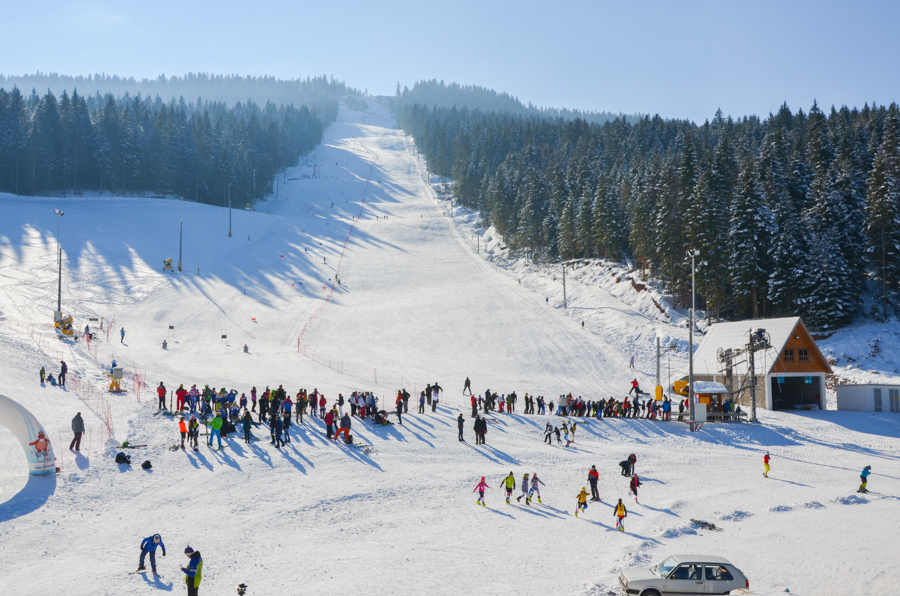

Предлог пројекта - Планински дрворед
====================================

Мотивација
----------

.. questionnote::
    Да ли у месту где ти станујеш има доста дрвећа?  Да ли волиш да проводише време у шуми или парку и уживаш
    окружен/окружена зеленилом? Јеси ли некада посадиo/посадила дрво?

За шуме се каже још и да су "плућа" планете јер производе кисеоник. Дрвенасте биљке могу бити листопадне и 
зимзелене. Зимзелене биљке имају лист који не опада када дође јесен. С обзиром да
је лист неопходан и најзначајнији за произвидњу кисеоника (у њему  се врши фотосинтеза), то значи да оне производе кисеоник током целе године!

Наша земља је богата планинама обраслим шумом, а многе од њих су и зимски центари. Падине планина зими постају стазе за 
скијање, а уживање на њима потраже људи који желе чист ваздух и предивну природу. Скијашке стазе су увек изазов како
за почетнике
тако и за искусне скијаше. Обично су са обе стране окружене шумом коју најчешће чине разне врсте високих јелки. Јелке
спадају у зимзелене четинарске биљке чији је лист у облику иглица.

.. questionnote::
    Да ли си некада покушао/покушала да скијаш? Ако ниси, да ли би волео/волела да пробаш?

Анализа и планирање
-------------------

Истражи на интернету заступљеност биљних врста у шумама у Србији. Пронађи податке о најзаступљенијим врстама.
Направи кратку презентацију са прикупљеним подацима (текстом и 
сликама) коју ћеш презентовати разреду. Потражи помоћ наставника биологије око неких додатних информација.

Користећи Пајтон и Пајгејм, програмом нацртај једну ски стазу која се простире падином планине са дрворедом 
јелки са обе стране. Искористи досадашње знање, подсети се алата који
ће ти бити потребно и уживај у раду! Наравно, помоћ ће ти пружити наставник информатике када ти затреба.

Ресурси
-------

За прављење презентације и писање програма потребан вам је рачунарски кабинет и интернет.
Такође, поразговарајте са својим наставницима, првенствено наставником биологије,
који вас може детаљније упутити у биолошке аспекте и значај дрвенастих биљака. 

Напишите неки чланак, направите неки пано, посветите неки час овој теми. 

Код за цртање дрвореда
----------------------

Ваш дрворед можете да нацртате како ви желите у договору са вашим наставником. 
Можете искористити и делове наредног
кода, а можете кренути и са вашом идејом од самог почетка.

.. questionnote::

   Поред скијашке стазе постављена су два реда јелки. Напиши програм
   који исцртава ову скијашку стазу.

.. infonote::
    Најбоље би било да прво напишемо функцију која када јој се задају параметри црта једну јелку.
    Овакав приступ решавању омогућиће нам да вишеструким позивом ове Функције
    једноставно нацртамо цео дрворед!
 
Функција ће примати координате сидра (средину дна стабла
јелке), али и димензију јелке. Да би цртеж реалније изгледао
претпоставимо да неће све крошње бити у истој нијанси зелене боје,
већ да ће неке бити тамније, а неке светлије. Стога ћемо функцији за
цртање јелке прослеђивати и четврти параметар који ће представљати
фактор промене основне зелене боје. Промену боје можемо постићи кроз
посебну функцију која сваку појединачну компоненту дате боје множи са
задатим коефицијентом. Ако је тај коефицијент број мањи од 1, тада боја
постаје тамнија, а ако је већи од 1, тада боја постаје
светлија. Приликом сваког позива функције фактор ћемо одређивати као
насумично одабран реалан број из интервала :math:`[0.2, 2]`, позивом
функције ``random.uniform(0.2, 2.0)``.

У главном делу програма распоредићемо 6 јелки левог и 6 јелки десног
дрвореда. У петљама ћемо одржавати координате сидра текуће јелке. Леви
дрворед ће кретати мало испод линије хоризонта и мало лево од
половине ширине прозора и свако дрво ће бити померено доле и лево у
односу на претходно. То ћемо постићи тако што ћемо у сваком кораку
петље умањивати x и увећавати y координату. Слично, десни дрворед ће
кретати мало испод линије хоризонта и мало десно од половине ширине
прозора и свако дрво ће бити померено доле и десно у односу на
претходно. То ћемо постићи тако што ћемо у сваком кораку петље
увећавати и x и y координату. Да би се постигао ефекат перспективе,
свако наредно дрво биће мало веће у односу на претходно. То ћемо
постићи тако што ћемо у сваком кораку петље увећавати и димензију
текућег дрвета.

Допуни наредни програм на основу претходне дискусије.

.. activecode:: suma2
   :playtask:
   :nocodelens:
   :modaloutput: 
   :enablecopy:
   :includexsrc: _includes/suma2.py

   def promeni_nijansu(boja, faktor):
       (r, g, b) = boja
       return (round(r*faktor), round(g*faktor), ???)
    
   def jelka(x, y, dim, faktor_promene_boje):
       # boje koje cemo koristiti
       CRNA  = (0, 0, 0)
       ZELENA = (0, 100, 36)
       BRAON = (97, 26, 9)
       nijansa_zelene = promeni_nijansu(ZELENA, faktor_promene_boje)
       
       j = dim / 300
       pg.draw.rect(prozor, BRAON, (x-20*j, y-50*j, 40*j, 50*j))
       # krošnja - trougao A
       Alevo = (x-100*j, y-50*j)
       Adesno = (x+100*j, y-50*j)
       Agore = (x, y-150*j)
       pg.draw.polygon(prozor, nijansa_zelene, [Alevo, Adesno, Agore])
       # krošnja - trougao B
       Blevo = (x-75*j, y-100*j)
       Bdesno = (x+75*j, y-100*j)
       Bgore = (x, y-200*j)
       pg.draw.polygon(prozor, nijansa_zelene, [Blevo, Bdesno, Bgore])
       # krošnja - trougao C
       ???
    
   # bojimo pozadinu u belo
   prozor.fill(pg.Color("white"))
   horizont_y = visina * 0.55         # visina linije horizonta
   # crtamo nebo i sunce
   pg.draw.rect(prozor, pg.Color("skyblue"), (0, 0, sirina, horizont_y))
   pg.draw.circle(prozor, pg.Color("yellow"), (150, 150), 65)
    
   broj_stabala = 6
    
   # crtatmo levi drvored
   x, y, dim = sirina / 2 - 0.1 * sirina, horizont_y + 0.1 * visina,  150
   for i in range(broj_stabala):
       jelka(x, y, dim, random.uniform(0.2, 2.0))
       x -= 0.075 * sirina
       y += 0.05 * visina
       dim += 20
    
   # crtamo desni drvored
   ???

Самоевалуација
--------------

Када направиш програм, покушај да (пре свега себи) одговориш на ова питања:

- Да ли је, по твојој процени, пројекат успешно приведен крају? Колико си ти лично задовољан-задовољна урађеним? Зашто?
- Који део је био посебно тежак? Како си га решио-решила? Да ли је постојао неки проблем чијим решавањем се посебно поносиш?
- Да ли је било накнадних измена првобитног плана? Због чега?
- Да ли је пројекат био користан за стицање или унапређивање неких знања или вештина? Којих?

Размисли шта од овога би било интересантно другима да чују током твог представљања пројекта. 